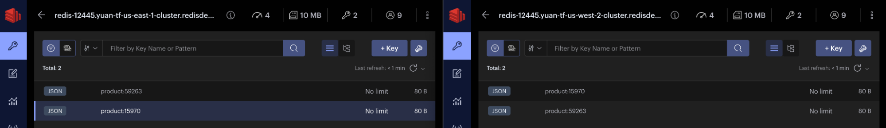

<!-- IaaS AWS Terraform Version with A-A Redis Search -->

**Real Time Query Workshop**

# Lab 6 - Deploying a 99.999 Redis Environment

## 1. Login to the Redis Enterprise admin console using the URL and credentials provided by your instructor

## 2. Create a new Geo Distributed CRDB database


## 3. Give your database a name following the pattern &lt;last-name>-crdb

* Add the RedisJSON and the RediSearch 2 module
* Add the participating clusters and leave 0.1 GB of memory limit


## 4. Note the endpoint of your recently created CRDB in us-east-1 and us-west-2 regions


##


## 5. Configure RedisInsight to connect to both CRDB regions


## 6. Open each CRDB region in a separate window


## 7. Create an index on each CRDB region

```c#
Console.WriteLine(ft.Create("idx1", new FTCreateParams()
                    .On(IndexDataType.JSON)
                    .Prefix("product:"),
                    new Schema()
                        .AddNumericField(new FieldName("$.id", "id"))
                        .AddTagField(new FieldName("$.gender", "gender"))
                        .AddTagField(new FieldName("$.season.*", "season"))
                        .AddTextField(new FieldName("$.description", "description"))
                        .AddNumericField(new FieldName("$.price", "price"))
                        .AddTextField(new FieldName("$.city", "city"))
                        .AddGeoField(new FieldName("$.coords", "coords"))));
```


## 8. Add a new JSON document on us-east-1 CRDB region and verify that it was propagated to us-west-2 CRDB region

```c#
IJsonCommands json = db.JSON();
json.Set("product:15970", "$", new {
    id = 15970,
    gender = "Men",
    season = new[] {"Fall", "Winter"},
    description = "Turtle Check Men Navy Blue Shirt",
    price = 34.95,
    city = "Boston",
    coords = "-71.057083, 42.361145"});
```


## 9. Search for "shirt" on both CRDB regions and verify that you get results on both regions

```c#
foreach (var doc in ft.Search("idx1", new Query("@description:shirt"))
                    .Documents.Select(x => x["json"]))
{
    Console.WriteLine(doc);
}
```


## 10. Now add a second JSON document on us-west-2 CRDB region and verify that it was propagated to us-east-1 CRDB region

```c#
json.Set("product:59263", "$", new {
    id = 59263,
    gender = "Women",
    season = new[] {"Fall", "Winter", "Spring", "Summer"},
    description = "Titan Women Silver Watch",
    price = 129.99,
    city = "Dallas",
    coords = "-96.808891, 32.779167"}););
```



## 11. Search for the "Winter" season tag on both CRDB regions and verify that you get two results on both regions

```c#
foreach (var doc in ft.Search("idx1", new Query("@season:{Winter}"))
                .Documents.Select(x => x["json"]))
{
    Console.WriteLine(doc);
}
```


