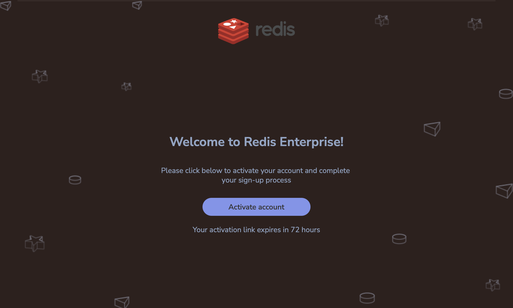
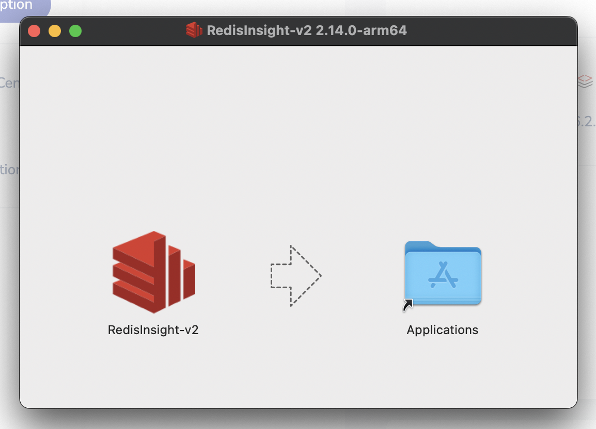
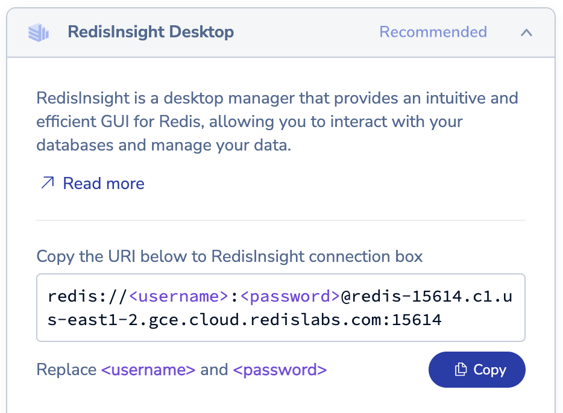
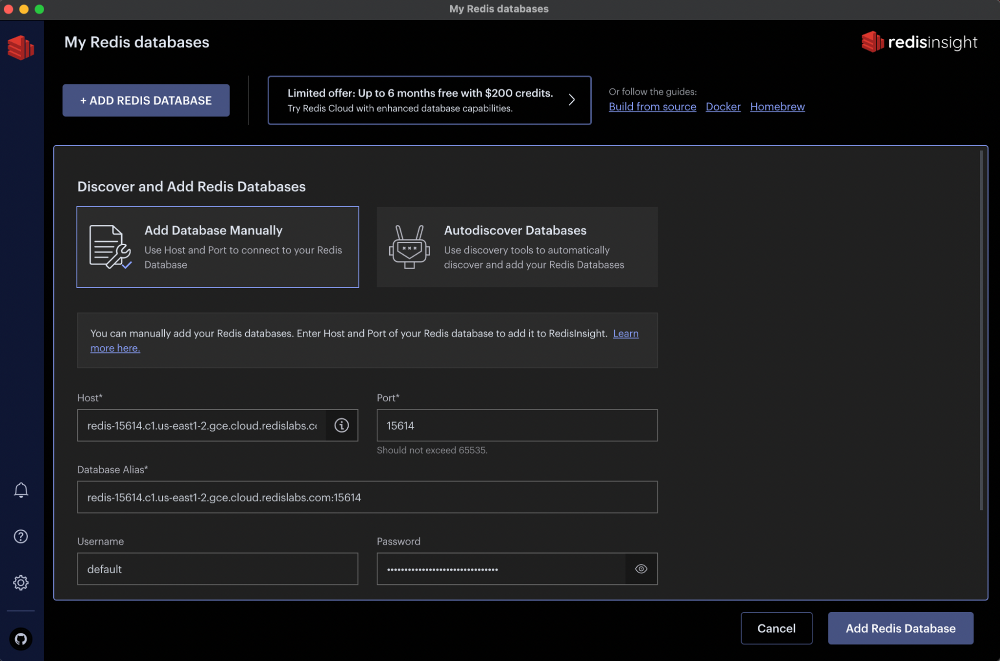
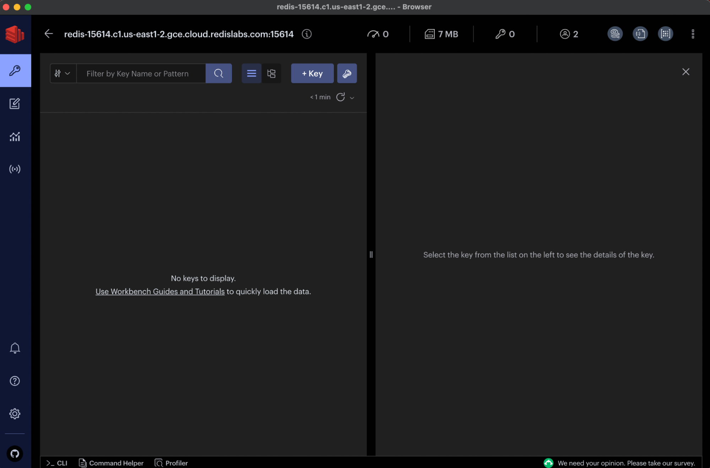

**Real Time Query Workshop**

# Lab 1 - Create your Redis Environment

## 1. Sign up for the Redis Cloud trial

Visit [https://redis.com/try-free/](https://redis.com/try-free/) and sign-up for a free trial:


## 2. Check your email to verify your account



## 3. Login with your new credentials


## 4. Click "+ New Subscription" to add a new subscription to your account


## 5. Select a free Fixed plan using a cloud provider and region of your choice


## 6. Name your subscription and click "Create Subscription"


## 7. Create a new database under your newly created subscription


## 8. Give a name to your new database and select type "Redis Stack"


## 9. Set a password for your database


## 10. Activate your new database


## 11. Download RedisInsight Desktop on your laptop


## 12. Install RedisInsight Desktop



## 13. Open RedisInsight Desktop and add a new database


## 14. Copy the URI details of your new database and paste it in RedisInsight





## 15. Your Redis database has been added and is ready to be used


## 16. Your environment is now ready for the labs in this workshop



## 17. Java Setup
### Packages
```bash
import redis.clients.jedis.JedisPooled;
import redis.clients.jedis.Protocol;
import redis.clients.jedis.util.SafeEncoder;
import java.io.InputStream;
import java.util.Properties;
```
### Connect Client
```java
        JedisPooled client = null;
        try {
            InputStream input = ClassLoader.getSystemResourceAsStream("config.properties");
            Properties prop = new Properties();
            prop.load(input);
            client = new JedisPooled(prop.getProperty("redis.host"),
                Integer.parseInt(prop.getProperty("redis.port")), 
                prop.getProperty("redis.user"), 
                prop.getProperty("redis.password"));
            Object result = client.sendCommand(Protocol.Command.PING, "HELLO");
            System.out.println(SafeEncoder.encode((byte[]) result));
        }
        catch (Exception ex) {
            ex.printStackTrace();
        }
        return client;
```
### Result
```bash
HELLO
```