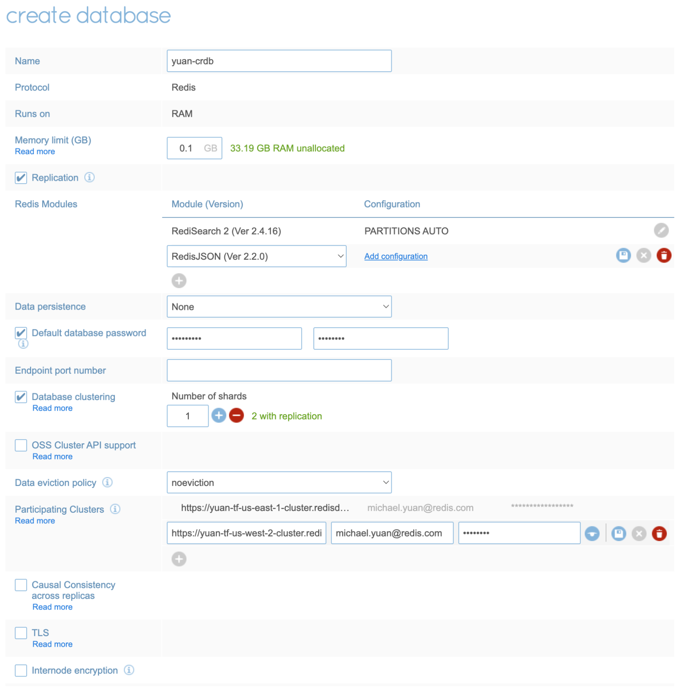

<!-- IaaS AWS Terraform Version with A-A Redis Search -->

**Real Time Query Workshop**

# Lab 6 - Deploying a 99.999 Redis Environment

## 1. Login to the Redis Enterprise admin console using the URL and credentials provided by your instructor

## 2. Create a new Geo Distributed CRDB database


## 3. Give your database a name following the pattern &lt;last-name>-crdb

* Add the RedisJSON and the RediSearch 2 module
* Add the participating clusters and leave 0.1 GB of memory limit



## 4. Note the endpoint of your recently created CRDB in us-east-1 and us-west-2 regions


##


## 5. Configure RedisInsight to connect to both CRDB regions


## 6. Open each CRDB region in a separate window


## 7. Create an index on each CRDB region

```java
        Schema schema = new Schema().addNumericField("$.id").as("id")
            .addTagField("$.gender").as("gender")
            .addTagField("$.season.*").as("season")
            .addTextField("$.description", 1.0).as("description")
            .addNumericField("$.price").as("price")
            .addTextField("$.city",1.0).as("city")
            .addGeoField("$.coords").as("coords");
        IndexDefinition rule = new IndexDefinition(IndexDefinition.Type.JSON)
            .setPrefixes(new String[]{"product:"});
        client.ftCreate("idx1", IndexOptions.defaultOptions().setDefinition(rule), schema);
```


## 8. Add a new JSON document on us-east-1 CRDB region and verify that it was propagated to us-west-2 CRDB region

```java
        Product prod15970 = new Product(15970, "Men", new String[]{"Fall", "Winter"}, "Turtle Check Men Navy Blue Shirt",
        34.95, "Boston", "-71.057083, 42.361145");
        Gson gson = new Gson();
        client.jsonSet("product:15970", gson.toJson(prod15970)); 
```


## 9. Search for "shirt" on both CRDB regions and verify that you get results on both regions

```java
        Query q = new Query("@description:shirt");
        SearchResult res = client.ftSearch("idx1", q);
        List<Document> docs = res.getDocuments();
        for (Document doc : docs) {
            System.out.println(doc);
        }
```


## 10. Now add a second JSON document on us-west-2 CRDB region and verify that it was propagated to us-east-1 CRDB region

```java
        Product prod59263 = new Product(59263, "Women", new String[]{"Fall", "Winter", "Spring", "Summer"}, "Titan Women Silver Watch",
                                129.99, "Dallas", "-96.808891, 32.779167");
        client.jsonSet("product:59263", gson.toJson(prod59263));      
```


## 11. Search for the "Winter" season tag on both CRDB regions and verify that you get two results on both regions

```java
        q = new Query("@season:{Winter}");
        res = client.ftSearch("idx1", q);
        docs = res.getDocuments();
        for (Document doc : docs) {
            System.out.println(doc);
        }
```


