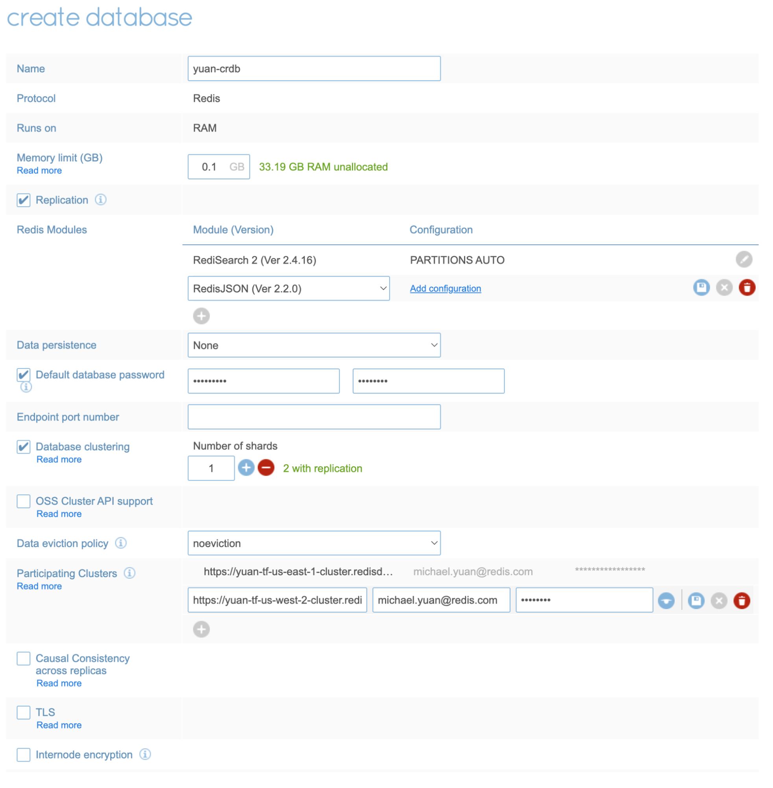
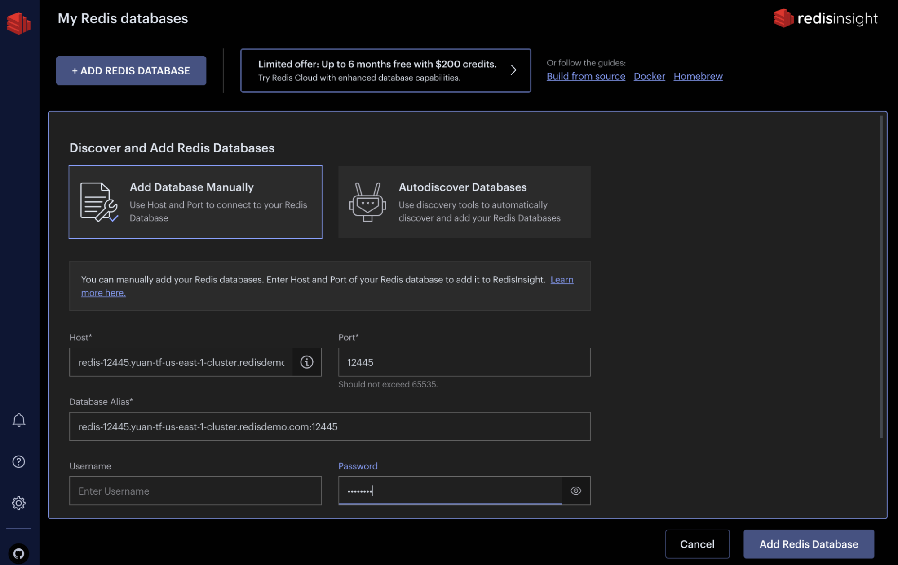
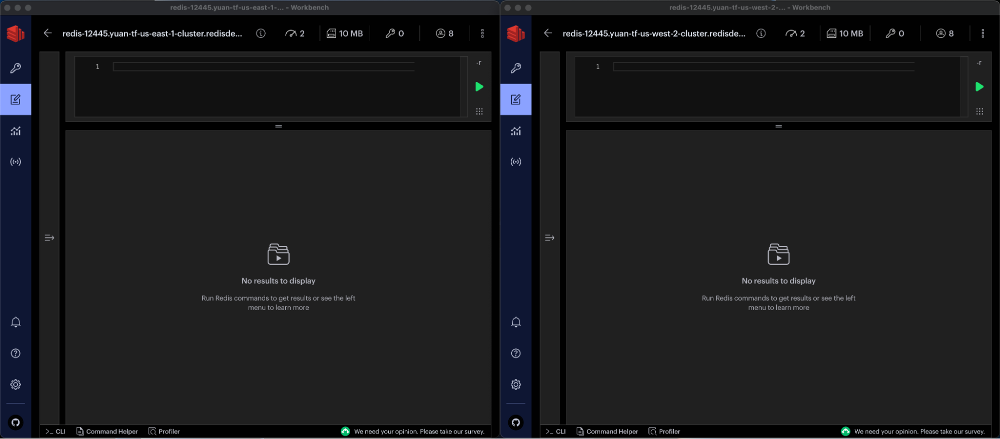

<!-- IaaS AWS Terraform Version with A-A Redis Search -->

**Real Time Search Workshop**

Lab 6 - Deploying a 99.999 Redis Environment

##### 1. Login to the Redis Enterprise admin console using the URL and credentials provided by your instructor

##### 2. Create a new Geo Distributed CRDB database 


##### 3. Give your database a name following the pattern &lt;last-name>-crdb

* Add the RedisJSON and the RediSearch 2 module 
* Add the participating clusters and leave 0.1 GB of memory limit 



##### 4. Note the endpoint of your recently created CRDB in us-east-1 and us-west-2 regions


##### 


##### 6. Configure RedisInsight to connect to both CRDB regions




##### 7. Open each CRDB region in a separate window



##### 8. Create an index on each CRDB region

```c#
Console.WriteLine(ft.Create("idx1", new FTCreateParams()
                    .On(IndexDataType.JSON)
                    .Prefix("product:"),
                    new Schema()
                        .AddNumericField(new FieldName("$.id", "id"))
                        .AddTagField(new FieldName("$.gender", "gender"))
                        .AddTagField(new FieldName("$.season.*", "season"))
                        .AddTextField(new FieldName("$.description", "description"))
                        .AddNumericField(new FieldName("$.price", "price"))
                        .AddTextField(new FieldName("$.city", "city"))
                        .AddGeoField(new FieldName("$.coords", "coords"))));
```


##### 9. Add a new JSON document on us-east-1 CRDB region and verify that it was propagated to us-west-2 CRDB region

```c#
IJsonCommands json = db.JSON();
json.Set("product:15970", "$", new {
    id = 15970, 
    gender = "Men", 
    season = new[] {"Fall", "Winter"}, 
    description = "Turtle Check Men Navy Blue Shirt", 
    price = 34.95, 
    city = "Boston", 
    coords = "-71.057083, 42.361145"});
```


##### 10. Search for "shirt" on both CRDB regions and verify that you get results on both regions

```c#
foreach (var doc in ft.Search("idx1", new Query("@description:shirt"))
                    .Documents.Select(x => x["json"]))
{
    Console.WriteLine(doc);
}
```


##### 11. Now add a second JSON document on us-west-2 CRDB region and verify that it was propagated to us-east-1 CRDB region

```c#
json.Set("product:59263", "$", new {
    id = 59263, 
    gender = "Women", 
    season = new[] {"Fall", "Winter", "Spring", "Summer"},
    description = "Titan Women Silver Watch", 
    price = 129.99, 
    city = "Dallas", 
    coords = "-96.808891, 32.779167"}););
```


##### 12. Search for the "Winter" season tag on both CRDB regions and verify that you get two results on both regions

```c#
foreach (var doc in ft.Search("idx1", new Query("@season:{Winter}"))
                .Documents.Select(x => x["json"]))
{
    Console.WriteLine(doc);
}
```


