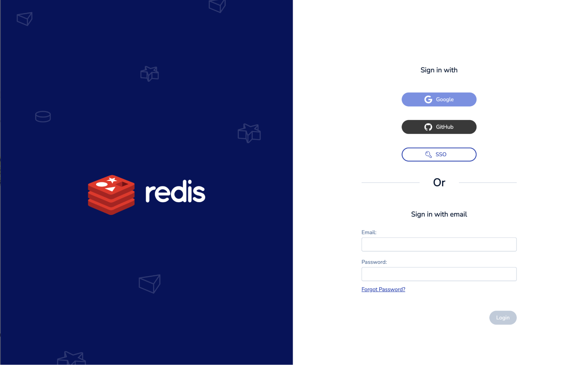
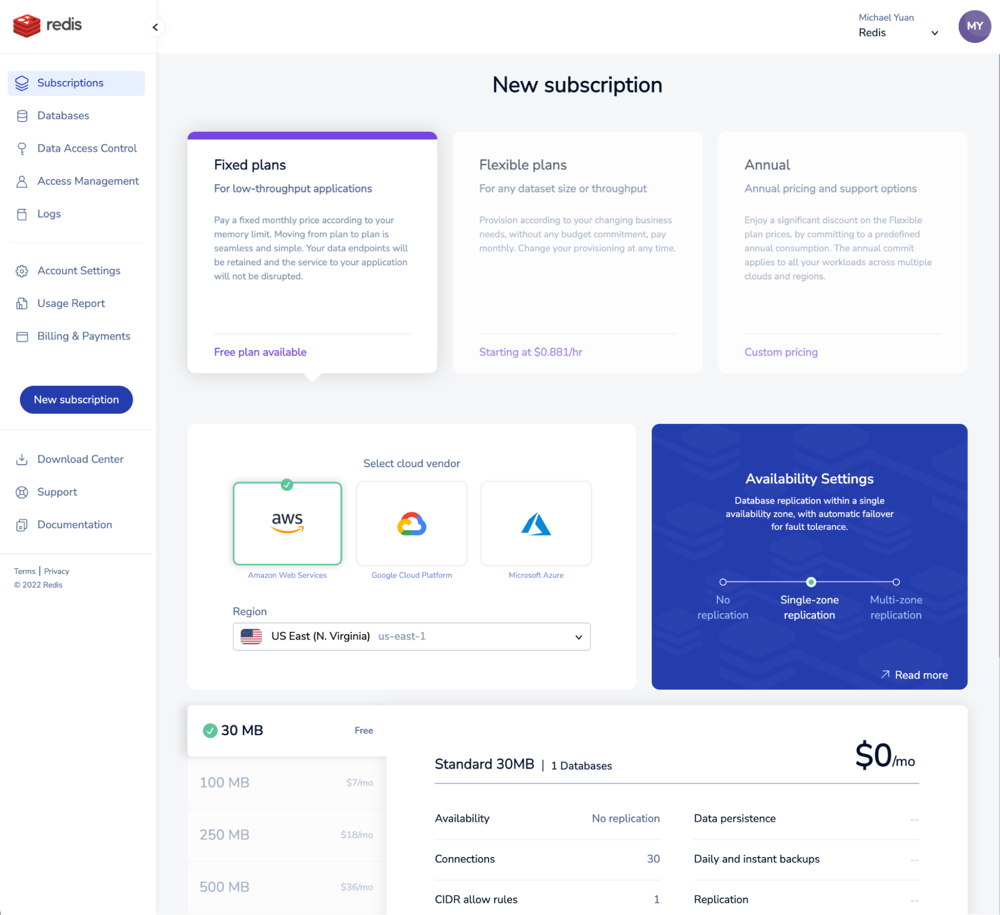
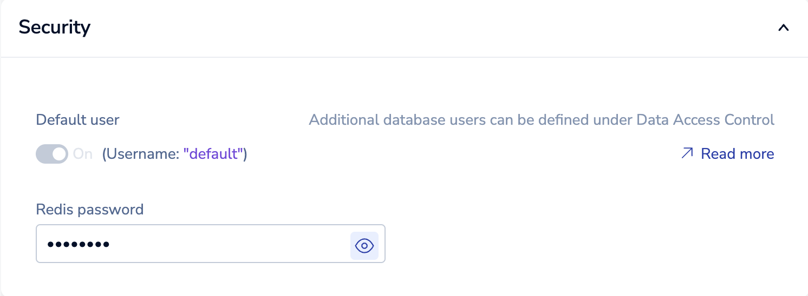

**Real Time Search Workshop**

Lab 0 - Create your Redis Environment

##### 1. Sign up for the Redis Cloud trial

Visit [https://redis.com/try-free/](https://redis.com/try-free/) and sign-up for a free trial:

##### 2. Check your email to verify your account

##### 3. Login with your new credentials

##### 4. Click "+ New Subscription" to add a new subscription to your account

##### 5. Select a free Fixed plan using a cloud provider and region of your choice

##### 6. Name your subscription and click "Create Subscription"

##### 7. Create a new database under your newly created subscription

##### 8. Give a name to your new database and select type "Redis Stack"

##### 9. Set a password for your database

##### 10. Activate your new database

##### 11. Download and install RedisInsight Desktop on your laptop

