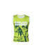

# Lab 5 - Advanced Search
Aggregation and other more complex RediSearch queries
## Contents
1.  [Business Value Statement](#value)
2.  [Vector Similarity Search](#vss)
    1.  [Data Set](#vss_dataset)
    2.  [Data Load](#vss_dataload)
    3.  [Index Creation](#vss_index)
    4.  [Search](#vss_search)
3.  [Advanced Search Queries](#adv_search)
    1.  [Data Set](#advs_dataset)
    2.  [Data Load](#advs_dataload)
    3.  [Index Creation](#advs_index)
    4.  [Search w/JSON Filtering - Example 1](#advs_ex1)
    5.  [Search w/JSON Filtering - Example 2](#advs_ex2)
4.  [Aggregation](#aggr)
    1.  [Data Set](#aggr_dataset)
    2.  [Data Load](#aggr_dataload)
    3.  [Index Creation](#aggr_index)
    4.  [Aggregation - Count](#aggr_count)
    5.  [Aggregation - Sum](#aggr_sum)

## Business Value Statement <a name="value"></a>
Redis provides the following additional advanced search capabilities to derive further value of Redis-held data:
* Vector Similarity Search - Store and search by ML-generated encodings of text and images
* Search + JSON Filtering - Combine the power of search with JSONPath filtering of search results
* Aggregation - Create processing pipelines of search results to extract analytic insights.

## Vector Similarity Search (VSS) <a name="vss"></a>
### Data Set <a name="vss_dataset"></a>
- Image 16185: Enroute Men Leather Black Formal Shoes  

- Image 4790: ADIDAS Sky Ball Brown T-shirt  

- Image 25628: Fastrack Women Charcoal Grey Dial Watch  

### Data Load <a name="vss_dataload"></a>
```bash
JSON.SET image:16185 $ '{"image_id": "16185", "image_vector": [1.5003312826156616, 2.1687207221984863, 0.14318057894706726, 0.10043102502822876, 0.04274366423487663, 0.4882563054561615, 0.06814898550510406, 0.26162758469581604, 1.796882152557373, 1.3547947406768799, 1.339775562286377, 0.8866013288497925, 0.017590612173080444, 0.3928144872188568, 0.2722119987010956, 0.6445047855377197, 0.5987589955329895, 0.18756769597530365, 0.655311107635498, 0.2101927399635315, 0.07712674140930176, 0.6057865619659424, 0.31675729155540466, 2.2222330570220947, 0.7124079465866089, 1.986050009727478, 0.764743983745575, 2.208350896835327, 0.28284305334091187, 0.19864781200885773, 0.03318127244710922, 0.0544743575155735, 1.6633970737457275, 0.21829569339752197, 0.16232316195964813, 0.004093455150723457, 0.05576060712337494, 0.01248473022133112, 0.177387997508049, 0.168716698884964, 0.7159070372581482, 4.937667369842529, 2.5908162593841553, 0.10292196273803711, 0.1915302723646164, 1.249654769897461, 0.6338828802108765, 0.042402442544698715, 0.9386232495307922, 1.2340959310531616, 0.08452612161636353, 0.8745591044425964, 0.23128007352352142, 0.000939521356485784, 2.9989473819732666, 1.5065464973449707, 1.066115140914917, 0.3670850098133087, 1.1985760927200317, 2.8896877765655518, 0.9241295456886292, 0.48091554641723633, 0.021185049787163734, 2.0387089252471924, 2.9243574142456055, 0.18760313093662262, 0.3654434084892273, 0.39596161246299744, 0.5700433254241943, 1.3067713975906372, 1.4139548540115356, 0.2067197859287262, 1.5970449447631836, 0.09350954741239548, 1.7160451412200928, 0.1431887447834015, 0.2729112505912781, 0.1446426957845688, 0.3070637881755829, 0.21470360457897186, 0.7632814645767212, 4.9261794090271, 0.18640030920505524, 1.999403715133667, 0.7719210982322693, 1.5823792219161987, 0.6379010081291199, 0.4669722020626068, 1.9500101804733276, 0.6122087836265564, 0.12538427114486694, 2.0434887409210205, 0.8589099049568176, 0.0394953228533268, 0.057459864765405655, 0.42053213715553284, 1.7813600301742554, 0.05239599198102951, 0.2634890675544739, 0.8783164620399475, 0.0014940376859158278, 1.6510310173034668, 0.661802351474762, 0.11912374943494797, 0.9871295094490051, 2.8381996154785156, 3.8803701400756836, 6.00374174118042, 1.3654316663742065, 0.0, 0.4114624261856079, 0.0, 0.8746970295906067, 0.9101914167404175, 0.117866650223732, 1.7197102308273315, 1.7256567478179932, 0.016107378527522087, 0.0006669930880889297, 0.9765627384185791, 0.16243532299995422, 0.0325729139149189, 1.6472138166427612, 1.5465950965881348, 0.0954180657863617, 0.21199582517147064, 0.728144645690918, 1.897817850112915, 0.3783484995365143, 0.6340737342834473, 0.1597568392753601, 1.4090495109558105, 0.07080096751451492, 0.5088695883750916, 0.256723552942276, 2.106689453125, 0.057641033083200455, 0.5624834895133972, 0.5149914026260376, 0.9371159076690674, 1.788880467414856, 0.08415056765079498, 0.1892571747303009, 0.07907711714506149, 0.0967102125287056, 0.8275996446609497, 0.040462348610162735, 0.6722112894058228, 0.6166321635246277, 0.8535882830619812, 0.0, 0.2241688370704651, 0.9123849868774414, 1.544103980064392, 0.47575077414512634, 0.7762298583984375, 0.3229338526725769, 0.0, 0.15736503899097443, 0.13747286796569824, 1.2367080450057983, 0.09022840857505798, 0.4548546075820923, 0.02825685404241085, 1.1661525964736938, 0.9396397471427917, 1.1347641944885254, 0.27820226550102234, 0.1412573605775833, 0.8575685620307922, 0.3155023753643036, 2.4965600967407227, 0.1582639366388321, 0.16691914200782776, 0.5115804076194763, 0.20523470640182495, 1.5450857877731323, 0.12569908797740936, 0.4141976535320282, 0.1328839510679245, 0.4249248802661896, 1.5754591226577759, 0.25274205207824707, 1.2514227628707886, 0.10412345826625824, 0.2538643479347229, 0.9922100901603699, 2.667515993118286, 0.007352416403591633, 0.18995817005634308, 0.008915280923247337, 0.5954692363739014, 2.091780424118042, 0.11958706378936768, 2.1035232543945312, 1.3696701526641846, 0.4185813069343567, 0.1298653483390808, 0.0697781965136528, 0.2529314160346985, 0.23167023062705994, 0.8212597370147705, 0.5275190472602844, 0.44959160685539246, 0.007820512168109417, 0.05036824941635132, 0.4658207893371582, 1.9922841787338257, 0.018208056688308716, 0.12691830098628998, 0.00516257481649518, 0.5824648141860962, 0.17258287966251373, 0.3300127685070038, 3.638322591781616, 3.543836832046509, 0.04422533139586449, 1.7063586711883545, 0.29513540863990784, 1.6059895753860474, 0.0, 1.112644076347351, 0.47284987568855286, 0.5489595532417297, 0.10137328505516052, 2.0889620780944824, 3.9458601474761963, 0.06190962344408035, 0.41560760140419006, 5.0148138999938965, 6.373712539672852, 0.04115068539977074, 0.43223676085472107, 0.5745556950569153, 0.9280039072036743, 0.7474240660667419, 3.192406415939331, 1.5318710803985596, 0.03818271681666374, 0.4819285273551941, 0.44562971591949463, 0.9574170708656311, 2.2589471340179443, 0.032774485647678375, 0.4219233989715576, 0.14271487295627594, 0.9584283828735352, 2.788710832595825, 0.6556198596954346, 0.312051385641098, 0.7025960087776184, 0.0, 0.6005482077598572, 1.2855610847473145, 0.14496709406375885, 0.5120407342910767, 0.30599305033683777, 0.14497120678424835, 2.9293220043182373, 0.09266413748264313, 1.0124448537826538, 0.04305736720561981, 0.27179908752441406, 0.10003017634153366, 0.27587658166885376, 0.4731479287147522, 0.5725278854370117, 0.05384771153330803, 2.0247020721435547, 0.7859348654747009, 0.2514788508415222, 0.05882754176855087, 0.45114636421203613, 0.13261911273002625, 1.6414722204208374, 4.443170070648193, 0.22948278486728668, 2.6340630054473877, 0.5774695873260498, 0.9406563639640808, 0.1545127034187317, 4.890054225921631, 0.007152678910642862, 0.9746572375297546, 1.1365647315979004, 0.3127424716949463, 1.0456368923187256, 0.3170333206653595, 0.26861757040023804, 1.2279231548309326, 1.286810278892517, 0.4161485433578491, 0.8428394794464111, 0.5338078141212463, 0.6969404220581055, 0.2394970804452896, 0.6309927701950073, 0.04036017879843712, 0.7703349590301514, 1.701852798461914, 2.4263439178466797, 1.08440363407135, 0.3774823546409607, 0.22641824185848236, 2.033689022064209, 0.7775036692619324, 0.1609000563621521, 0.11792396754026413, 0.0030306996777653694, 1.1953318119049072, 0.4912738502025604, 2.1450905799865723, 0.07827533036470413, 0.9048893451690674, 0.8509892225265503, 0.9698935747146606, 0.0, 1.6394597291946411, 0.338331013917923, 0.583036482334137, 0.8658033013343811, 0.14136360585689545, 0.06846015155315399, 0.19064871966838837, 0.22706738114356995, 0.3601345121860504, 0.44414520263671875, 0.2729256749153137, 0.011766894720494747, 0.358200341463089, 3.759399175643921, 0.17881248891353607, 0.04050222784280777, 1.690453052520752, 0.13944773375988007, 0.6574854850769043, 2.4611732959747314, 0.32859480381011963, 0.04470517858862877, 3.073888063430786, 1.0102193355560303, 0.6605178713798523, 0.16792133450508118, 1.0513629913330078, 0.471666544675827, 0.07007741183042526, 2.1633074283599854, 0.6773842573165894, 1.5498768091201782, 1.2259482145309448, 0.23725654184818268, 0.30918753147125244, 0.5126348733901978, 0.16600348055362701, 1.8842406272888184, 0.22070221602916718, 0.10602930933237076, 2.296430826187134, 0.08981294929981232, 0.0008384882821701467, 1.5030165910720825, 0.03607260808348656, 3.0285346508026123, 0.05193454399704933, 1.4719996452331543, 0.13277125358581543, 0.14934051036834717, 2.344489812850952, 1.2577403783798218, 0.8649536371231079, 0.22755958139896393, 0.8282724618911743, 0.2421763837337494, 0.6472818851470947, 1.0179787874221802, 0.4013883173465729, 1.3290293216705322, 0.4020504057407379, 0.03076338768005371, 1.5214864015579224, 0.012097768485546112, 1.322795033454895, 0.09146815538406372, 1.1446442604064941, 0.1807858943939209, 0.0, 0.3871800899505615, 0.02241760678589344, 0.20548617839813232, 1.051904559135437, 0.7749902606010437, 0.1065579429268837, 0.7775177359580994, 0.030379464849829674, 0.0018201489001512527, 0.0630376860499382, 0.087309330701828, 0.6391242742538452, 0.106516994535923, 0.3255371153354645, 0.47427353262901306, 1.9007593393325806, 0.9804282188415527, 0.9371476173400879, 0.7214860916137695, 0.16859562695026398, 1.5948591232299805, 0.0030219126492738724, 3.690695285797119, 1.5702240467071533, 0.32089555263519287, 0.8261326551437378, 0.07801790535449982, 1.6056456565856934, 2.618349552154541, 1.3529767990112305, 1.0122227668762207, 1.4440351724624634, 1.8449344635009766, 0.04398282244801521, 0.12642104923725128, 2.452476739883423, 1.2445710897445679, 0.9261311292648315, 0.1059238389134407, 0.007836587727069855, 0.40296414494514465, 2.138871431350708, 2.3497886657714844, 0.40643081068992615, 0.8490850329399109, 1.5461808443069458, 0.07154141366481781, 1.564293384552002, 2.7405402660369873, 0.019976342096924782, 0.8804471492767334, 0.8222239017486572, 1.1839001178741455, 0.5379825234413147, 0.0026856716722249985, 1.4547717571258545, 0.02663484960794449, 0.4739110767841339, 0.8704559803009033, 0.3755817711353302, 1.8036082983016968, 1.525183081626892, 1.2075532674789429, 0.1728861927986145, 0.2378842681646347, 0.01648930087685585, 0.13919243216514587, 0.05421869084239006, 1.8606383800506592, 0.10063797980546951, 2.912816047668457, 0.2088714838027954, 0.45476657152175903, 0.7084609866142273, 0.5968790054321289, 1.6493412256240845, 0.15587593615055084, 0.10423987358808517, 1.042149543762207, 0.07062555104494095, 0.9769067764282227, 0.5527023673057556, 1.1387666463851929, 0.4663535952568054, 0.2593229115009308, 0.21651147305965424, 3.1526145935058594, 1.0319650173187256, 3.053621292114258, 0.11262327432632446, 0.37295809388160706, 1.5269049406051636, 1.7089004516601562, 0.39211082458496094, 0.596427321434021, 0.695684552192688, 1.4040552377700806, 0.0019641686230897903, 2.709948778152466, 0.29398196935653687, 1.5523762702941895, 0.32391080260276794, 1.9062474966049194, 1.2312120199203491, 0.5092812180519104, 0.6992761492729187, 0.5809427499771118,
 2.4403862953186035, 1.5670268535614014, 0.48783546686172485, 1.754852294921875, 1.027685523033142, 0.1598706692457199, 2.6746537685394287, 1.8900375366210938, 0.22053833305835724, 0.9508030414581299, 0.8855244517326355, 0.7943074107170105, 0.8768242001533508, 0.5082762837409973, 0.9732694029808044, 1.90229070186615, 0.7841629981994629, 0.3877132833003998, 2.7795979976654053]}'
```
```bash
JSON.SET image:4790 $ '{"image_id": "4790", "image_vector": [0.16230954229831696, 0.08474161475896835, 0.03148483857512474, 0.33275625109672546, 0.13095484673976898, 0.436422199010849, 0.15898185968399048, 0.32057514786720276, 0.2496367245912552, 0.580928385257721, 0.591397225856781, 0.052752260118722916, 1.6928516626358032, 0.20935800671577454, 0.2537393867969513, 1.1295009851455688, 0.9916528463363647, 0.4777607321739197, 0.0, 0.23069050908088684, 0.03580980747938156, 0.09255115687847137, 1.623257040977478, 1.9203901290893555, 0.5288264155387878, 0.33072996139526367, 0.5288330912590027, 2.913578510284424, 0.050144534558057785, 0.9988725781440735, 0.3854654133319855, 0.0019921190105378628, 0.44102463126182556, 0.9450884461402893, 2.2889797687530518, 1.1074581146240234, 0.4073309302330017, 0.08031763881444931, 0.24039451777935028, 1.0485938787460327, 0.763286828994751, 0.040102969855070114, 0.1847948282957077, 0.3273313045501709, 1.4639804363250732, 0.32700327038764954, 0.14674293994903564, 0.8534194231033325, 1.8166930675506592, 0.9421488046646118, 1.9642771482467651, 0.21556708216667175, 0.40059053897857666, 0.31930166482925415, 2.548015594482422, 2.032048225402832, 0.5177732706069946, 1.8988896608352661, 1.9294244050979614, 1.552004098892212, 0.0235503688454628, 0.8387219309806824, 0.18181906640529633, 1.0724844932556152, 0.615067720413208, 0.5301501154899597, 0.546689510345459, 0.19032898545265198, 0.9941057562828064, 0.639716386795044, 0.4824484884738922, 0.875746488571167, 0.8068352341651917, 0.4598279297351837, 0.49685946106910706, 0.21018581092357635, 0.9692109823226929, 3.2575714588165283, 0.8295386433601379, 1.0347284078598022, 0.9605013132095337, 1.475201964378357, 0.16832061111927032, 1.7408926486968994, 0.4617440402507782, 0.2872065305709839, 0.4832068383693695, 0.07267088443040848, 2.4440083503723145, 1.2767229080200195, 0.3972344994544983, 0.5275756120681763, 0.7478511333465576, 2.323720932006836, 0.4417155385017395, 0.7540262341499329, 0.8150819540023804, 2.0406994819641113, 0.20279008150100708, 0.33371108770370483, 0.8385985493659973, 1.482516884803772, 0.3813665807247162, 2.2142438888549805, 1.3915241956710815, 1.912790060043335, 4.958536624908447, 0.39801695942878723, 0.1551935076713562, 0.3900192081928253, 2.6482603549957275, 0.6472049951553345, 0.8196060657501221, 0.2567903995513916, 0.813383936882019, 1.7147903442382812, 0.6679642200469971, 0.7167125344276428, 1.0140727758407593, 1.4741785526275635, 0.4466549754142761, 0.29079508781433105, 0.15051548182964325, 1.2545510530471802, 1.9887808561325073, 0.8227455019950867, 0.26582056283950806, 0.6552860736846924, 0.4065820276737213, 0.057683296501636505, 0.5547189712524414, 0.4235074520111084, 0.2639786899089813, 0.05437136068940163, 0.42387717962265015, 0.34008151292800903, 1.2121282815933228, 0.028288308531045914, 0.461630254983902, 0.051551662385463715, 0.6750159859657288, 0.3808729946613312, 0.5918443202972412, 0.18275292217731476, 0.6264525651931763, 1.4294570684432983, 0.7002655267715454, 1.0492007732391357, 2.3604278564453125, 0.40242528915405273, 0.324014812707901, 1.5502859354019165, 3.765683650970459, 0.1813919097185135, 0.10697958618402481, 1.3712855577468872, 3.553373336791992, 0.2993077337741852, 0.07481291145086288, 0.30811807513237, 1.1236023902893066, 1.176841378211975, 0.10086638480424881, 0.07444395124912262, 0.349139928817749, 1.2311489582061768, 0.06006965413689613, 0.12132753431797028, 2.7920889854431152, 1.083332896232605, 0.6885524392127991, 0.7021082043647766, 0.6111348867416382, 0.6234455108642578, 1.4986755847930908, 1.7216720581054688, 0.0054425341077148914, 0.13929328322410583, 0.8955528140068054, 1.483749508857727, 1.9066720008850098, 0.37227919697761536, 0.2903165817260742, 1.4197957515716553, 1.1906993389129639, 0.883683979511261, 0.3052099645137787, 1.1420602798461914, 0.09359126538038254, 0.501224935054779, 0.9300092458724976, 0.30885615944862366, 1.2560081481933594, 0.6942833662033081, 1.1036500930786133, 0.26782655715942383, 2.6698224544525146, 0.9555874466896057, 2.3659589290618896, 0.02237715572118759, 1.6070066690444946, 0.3549569249153137, 0.8157266974449158, 2.2432661056518555, 1.1462819576263428, 0.20369471609592438, 0.07152669876813889, 0.5088557004928589, 1.500722885131836, 0.29279768466949463, 0.04677983745932579, 0.4536667764186859, 1.3170868158340454, 0.7218629717826843, 0.27141109108924866, 0.21718552708625793, 1.313961386680603, 0.05447429418563843, 0.07116326689720154, 0.6862999796867371, 0.3517768681049347, 0.40964841842651367, 1.314055323600769, 0.3086548149585724, 0.9189624190330505, 0.2006903737783432, 0.25214123725891113, 0.016999827697873116, 0.9148522019386292, 1.9509398937225342, 0.13520820438861847, 0.32471755146980286, 2.027461528778076, 0.8187639713287354, 0.5899125933647156, 1.083630084991455, 3.4066619873046875, 0.3623378872871399, 0.10444562137126923, 2.1116442680358887, 1.7341383695602417, 0.7431661486625671, 0.4208012521266937, 0.3382418155670166, 0.8443588614463806, 0.25358816981315613, 0.212241992354393, 0.37039658427238464, 0.11372668296098709, 1.2730627059936523, 0.3822614848613739, 0.47854673862457275, 0.9237604141235352, 0.5121991038322449, 0.04470366984605789, 0.807709813117981, 0.35511860251426697, 0.27874231338500977, 0.15267160534858704, 0.6567728519439697, 0.31054818630218506, 0.41716575622558594, 0.3378452658653259, 0.3888918459415436, 0.8337858319282532, 0.5949381589889526, 0.9047414064407349, 0.3845321834087372, 0.07298345863819122, 0.3034294843673706, 0.5294020771980286, 0.21212035417556763, 1.0976322889328003, 0.8880501389503479, 0.4850941002368927, 0.6386203169822693, 1.6928366422653198, 0.07131675630807877, 1.592025637626648, 0.2969161570072174, 1.1966924667358398, 0.7661495804786682, 0.20406806468963623, 0.13484594225883484, 0.6015223860740662, 0.7727394104003906, 0.10399878770112991, 0.145793154835701, 1.2045103311538696, 0.7572830319404602, 0.6308296918869019, 0.38256895542144775, 1.0156314373016357, 1.2333062887191772, 0.37668001651763916, 0.9950684309005737, 0.4858383238315582, 0.6996175646781921, 1.2446722984313965, 0.6177253127098083, 0.8155863881111145, 0.7015824317932129, 3.025639057159424, 0.09738272428512573, 0.618503987789154, 0.44973477721214294, 1.1268891096115112, 0.04117470234632492, 0.3365025520324707, 0.6440489292144775, 0.31379854679107666, 0.43470221757888794, 0.3707120418548584, 0.8634108901023865, 1.255880355834961, 0.3331683874130249, 0.0888855829834938, 0.6776329874992371, 1.7942854166030884, 0.16128486394882202, 2.141136407852173, 0.5867097973823547, 0.19716301560401917, 0.10809559375047684, 0.2825968861579895, 0.6219913363456726, 0.29526033997535706, 1.1257909536361694, 0.33789968490600586, 0.1212567538022995, 0.3658328056335449, 0.23780643939971924, 0.7053734660148621, 0.9377692341804504, 0.49846500158309937, 0.09275664389133453, 0.5261044502258301, 0.31172215938568115, 1.5750880241394043, 1.694333791732788, 0.9071891903877258, 0.3895919919013977, 1.6362395286560059, 2.0503997802734375, 0.5424583554267883, 0.21882712841033936, 0.6443631052970886, 0.5498221516609192, 1.139148473739624, 0.8552563786506653, 0.293495774269104, 0.11257947981357574, 0.11624135822057724, 0.3112820088863373, 0.040560781955718994, 0.4371974468231201, 0.1556181013584137, 0.7716330885887146, 1.7230055332183838, 0.8373842835426331, 0.4090198576450348, 0.6093209981918335, 0.02797188051044941, 0.23171398043632507, 1.460975170135498, 0.0772264301776886, 1.0074560642242432, 0.9942137002944946, 1.7661433219909668, 0.040280669927597046, 0.24728849530220032, 0.251314640045166, 0.7002382278442383, 0.7841477394104004, 2.3611197471618652, 0.7148938179016113, 0.5181641578674316, 0.8216460347175598, 0.3447490930557251, 1.5978611707687378, 1.6961750984191895, 0.8003960251808167, 2.2147932052612305, 0.3809417486190796, 0.29008543491363525, 0.015759525820612907, 1.3290282487869263, 1.0916850566864014, 0.3983653783798218, 0.37770509719848633, 0.06032094359397888, 0.14266392588615417, 0.12509572505950928, 0.17892014980316162, 0.9102396965026855, 0.44766104221343994, 1.743393898010254, 0.014260254800319672, 0.07990314811468124, 0.703325629234314, 0.4235318601131439, 0.4258987009525299, 0.44904646277427673, 0.1934601068496704, 0.10682297497987747, 0.3276820778846741, 0.14806479215621948, 1.0617157220840454, 0.13851697742938995, 2.074446439743042, 0.5397192239761353, 0.44856250286102295, 0.2953639626502991, 1.5132991075515747, 0.3956894874572754, 0.5777182579040527, 3.0935769081115723, 0.6756892204284668, 0.7376732230186462, 0.37092703580856323, 0.7035748362541199, 1.956394076347351, 0.4885942041873932, 1.042500376701355, 0.10558414459228516, 0.1453849971294403, 0.12329130619764328, 1.2577149868011475, 0.16414281725883484, 0.003002585144713521, 0.5837047100067139, 0.7824270129203796, 0.09648776799440384, 0.41789916157722473, 0.9763674139976501, 0.15373139083385468, 2.014812469482422, 0.18212822079658508, 0.7878408432006836, 2.610161542892456, 0.4355471134185791, 1.483533263206482, 4.629324913024902, 1.079486608505249, 2.8298351764678955, 1.2586358785629272, 0.12234894186258316, 0.15389977395534515, 0.058912500739097595, 0.8445462584495544, 0.22441215813159943, 0.03745116665959358, 0.6636695861816406, 0.038295503705739975, 0.535607099533081, 1.7485220432281494, 0.5310847759246826, 0.39355871081352234, 0.2254713773727417, 0.44476932287216187, 0.24530886113643646, 0.3690045475959778, 1.4937760829925537, 0.023437602445483208, 1.0735406875610352, 0.009057777002453804, 0.6412769556045532, 0.03448060527443886, 0.13314132392406464, 0.11263854056596756, 0.5427082777023315, 0.861041784286499, 1.3527570962905884, 0.5039460062980652, 0.6252737045288086, 0.38285064697265625, 0.12914340198040009, 0.028966587036848068, 0.6360801458358765, 1.028059959411621, 0.11495453864336014, 1.4607746601104736, 0.7065281867980957, 0.21191203594207764, 3.179823637008667, 0.21947962045669556, 0.5337029099464417, 0.37462955713272095, 0.5967452526092529,
 0.0063615962862968445, 1.1156684160232544, 0.591102659702301, 0.8984035849571228, 0.27652764320373535, 0.0, 0.1457039713859558, 0.030750742182135582, 0.3434368073940277, 0.12553642690181732, 0.040931336581707, 0.19475439190864563, 0.5140655040740967, 0.011738547123968601, 0.35372182726860046, 0.9196434617042542, 2.6162922382354736, 0.6785635948181152, 0.08306240290403366, 2.607516288757324, 0.13193367421627045, 0.265427827835083, 0.07517199963331223]}'
```
```bash
JSON.SET image:25628 $ '{"image_id": "25628", "image_vector": [1.4237507581710815, 0.6730179190635681, 2.398484468460083, 0.20485399663448334, 0.23994293808937073, 1.0179342031478882, 1.4946975708007812, 1.4135029315948486, 2.089953899383545, 2.5267064571380615, 1.1827031373977661, 0.5190054178237915, 1.075515627861023, 0.06295507401227951, 0.11284071207046509, 1.0831713676452637, 1.0290348529815674, 0.2761383056640625, 0.7173039317131042, 0.545949399471283, 1.6844487190246582, 0.14845311641693115, 0.8977960348129272, 1.8189287185668945, 0.567232608795166, 0.42707815766334534, 0.2942527234554291, 0.016103627160191536, 0.14660929143428802, 0.7211496233940125, 0.1339246779680252, 0.4299152195453644, 0.4876496493816376, 2.3790509700775146, 0.2754307687282562, 0.23356738686561584, 0.951484203338623, 0.6504625082015991, 0.8543442487716675, 0.11769571900367737, 0.1005539670586586, 0.015949716791510582, 0.22011615335941315, 0.18791256844997406, 0.7867027521133423, 1.3766769170761108, 1.6980193853378296, 0.28065159916877747, 0.11090045422315598, 0.650509774684906, 0.320276141166687, 1.4034596681594849, 0.35326647758483887, 0.38826867938041687, 4.118533134460449, 0.9691217541694641, 0.21611431241035461, 0.2293836623430252, 0.8568918704986572, 1.0045597553253174, 0.9260342717170715, 0.19220763444900513, 0.8351383805274963, 0.7906893491744995, 0.8260672688484192, 0.37668687105178833, 1.2562123537063599, 0.8793085813522339, 0.11979071795940399, 0.8282760381698608, 2.153916358947754, 0.10135030746459961, 1.1298290491104126, 1.6235038042068481, 0.050412047654390335, 0.7710722088813782, 0.924316942691803, 2.2428128719329834, 0.6221674084663391, 0.010489571839571, 2.0900278091430664, 4.8002824783325195, 0.35916775465011597, 0.028582030907273293, 2.1394875049591064, 0.48350387811660767, 0.14273498952388763, 0.6116234660148621, 0.32658514380455017, 0.8639640212059021, 0.29385724663734436, 0.7310509085655212, 1.9501394033432007, 0.014154084026813507, 1.6851202249526978, 3.8030407428741455, 0.7482892274856567, 0.5089101195335388, 0.8083394765853882, 0.6348233819007874, 0.18280400335788727, 2.518981456756592, 0.5230298042297363, 0.43812671303749084, 0.4540710151195526, 5.008976459503174, 0.6388984322547913, 0.4227266013622284, 1.0963977575302124, 2.3751137256622314, 1.5533381700515747, 0.0, 2.7036638259887695, 0.4082699716091156, 1.9794331789016724, 2.739825487136841, 0.10310496389865875, 0.047490499913692474, 0.7082074880599976, 0.33140552043914795, 0.7797920107841492, 0.2657630443572998, 0.4130464792251587, 1.829659342765808, 0.29103925824165344, 0.22300174832344055, 0.9696459174156189, 0.8155978322029114, 0.9720895886421204, 3.4105193614959717, 0.3046802580356598, 0.359148770570755, 0.9044074416160583, 0.0, 0.06727319955825806, 1.096292495727539, 0.6763831377029419, 0.00608247984200716, 2.891684055328369, 0.5818690657615662, 0.3583919405937195, 0.007648708764463663, 0.6113397479057312, 0.08013074100017548, 0.5721272230148315, 0.4647762179374695, 1.4703168869018555, 1.3386170864105225, 0.11288683116436005, 1.4517216682434082, 0.0033509391359984875, 1.4341093301773071, 1.4956873655319214, 0.302992582321167, 0.25847962498664856, 2.9930672645568848, 0.4772733449935913, 0.07539103180170059, 0.002981150057166815, 0.30971983075141907, 0.5233944654464722, 0.6263021230697632, 0.0785108134150505, 0.00397675484418869, 0.053807731717824936, 0.765917956829071, 0.2646261751651764, 2.683016777038574, 1.4733699560165405, 0.5023106932640076, 1.2710065841674805, 1.3390707969665527, 0.8478441834449768, 2.2391979694366455, 0.6540776491165161, 0.21547141671180725, 1.5038193464279175, 3.2249467372894287, 0.32039040327072144, 0.3963739573955536, 1.1183762550354004, 0.6162644028663635, 0.28539180755615234, 1.2525516748428345, 0.24393169581890106, 0.19723473489284515, 0.9439667463302612, 1.4480326175689697, 0.5482807755470276, 2.2234456539154053, 0.7273305058479309, 0.7224616408348083, 1.803850769996643, 0.08088894933462143, 2.360379219055176, 0.4033576548099518, 0.7273419499397278, 0.008862180635333061, 0.5290440320968628, 0.09578163921833038, 0.12226435542106628, 0.14454786479473114, 0.8453003168106079, 0.40355047583580017, 0.1751031130552292, 0.3937472999095917, 4.402803897857666, 0.42523208260536194, 0.7094520926475525, 0.01745005138218403, 0.1465223729610443, 1.1981128454208374, 0.05980488657951355, 1.6713812351226807, 0.6195042729377747, 0.2093576341867447, 0.2133406400680542, 0.642076849937439, 0.01729005202651024, 1.250659704208374, 0.0, 0.081417977809906, 0.15393710136413574, 0.03709977865219116, 0.126693457365036, 3.3137874603271484, 0.25039002299308777, 3.93454909324646, 0.3382076621055603, 0.7276971936225891, 0.544739305973053, 0.301261842250824, 0.2145826816558838, 1.200685977935791, 0.15836739540100098, 0.04493142291903496, 0.27748093008995056, 1.1853138208389282, 1.0243198871612549, 1.6610264778137207, 2.563418388366699, 0.5567920207977295, 0.867091953754425, 1.8224921226501465, 1.1023669242858887, 0.5685038566589355, 0.2660488486289978, 0.11773204058408737, 1.2131974697113037, 0.4897664785385132, 1.511232614517212, 1.3062468767166138, 1.2184772491455078, 1.4812448024749756, 0.12859489023685455, 1.1810373067855835, 0.0021431383211165667, 0.5922793745994568, 0.7285937666893005, 0.5349165201187134, 0.5336304903030396, 1.8680769205093384, 0.109957754611969, 0.3795376121997833, 0.1935047060251236, 0.7665554881095886, 0.3905937075614929, 0.6834656000137329, 2.5937602519989014, 0.25783297419548035, 0.5511152744293213, 0.0047992984764277935, 0.6503313779830933, 0.33582937717437744, 0.3835446536540985, 0.23191076517105103, 0.16422320902347565, 0.1454128921031952, 4.373018264770508, 0.7374023795127869, 1.2547460794448853, 0.5583221912384033, 0.0348169282078743, 0.29847031831741333, 1.8666512966156006, 0.3969988226890564, 0.2233639806509018, 2.005498170852661, 1.6124130487442017, 1.8103786706924438, 0.4529392123222351, 0.10930633544921875, 1.0388085842132568, 0.4736366271972656, 0.5191802382469177, 1.1578891277313232, 0.20169004797935486, 0.32434916496276855, 2.0055227279663086, 0.6978317499160767, 2.0147769451141357, 0.30617693066596985, 1.4319334030151367, 0.6631256341934204, 0.010029688477516174, 0.5397223234176636, 2.0974414348602295, 0.40835702419281006, 0.022517850622534752, 1.1688686609268188, 0.6691713333129883, 0.9192956686019897, 0.45111072063446045, 0.8472285866737366, 1.2671799659729004, 0.44993308186531067, 0.04315221682190895, 0.10918261110782623, 0.3401738703250885, 1.6273484230041504, 1.2392148971557617, 1.1692699193954468, 5.311342716217041, 0.38084983825683594, 0.5952161550521851, 0.9463973641395569, 0.9568333625793457, 0.6654859781265259, 0.07746963202953339, 0.2626921832561493, 0.43411964178085327, 1.3891983032226562, 2.722337007522583, 0.1394282877445221, 0.14890147745609283, 0.03373894840478897, 1.8263459205627441, 0.35399043560028076, 0.36502593755722046, 0.46594515442848206, 1.692658543586731, 0.5095193386077881, 1.6686300039291382, 0.6377692222595215, 0.25529420375823975, 0.07118507474660873, 0.23059464991092682, 0.2682604193687439, 0.5369600057601929, 0.8516331911087036, 0.1946021318435669, 0.957422137260437, 0.045150741934776306, 1.3001796007156372, 1.7824040651321411, 0.11879575252532959, 1.1751750707626343, 2.495154857635498, 0.023204881697893143, 0.7427464127540588, 3.5174388885498047, 0.5604673624038696, 1.1494691371917725, 0.7829861640930176, 1.2782073020935059, 0.1910020262002945, 0.31137144565582275, 1.6824350357055664, 0.49070578813552856, 0.5213233232498169, 0.6743525266647339, 0.026046589016914368, 0.10187919437885284, 1.266756534576416, 0.08230537921190262, 0.5971156358718872, 0.3154933750629425, 1.7227308750152588, 1.3898075819015503, 0.43284496665000916, 1.137682318687439, 0.14774680137634277, 0.7904776930809021, 0.7067467570304871, 1.0756546258926392, 1.1087990999221802, 1.0681980848312378, 0.12598565220832825, 0.10007108747959137, 1.8257635831832886, 0.6230965256690979, 1.1951709985733032, 0.06165541335940361, 0.026287825778126717, 0.0014118846738711, 0.0, 1.107264518737793, 0.08087167888879776, 0.5435329675674438, 1.7641514539718628, 0.07444346696138382, 1.1947823762893677, 1.4850411415100098, 0.05009886249899864, 0.7572026252746582, 0.9302833080291748, 2.9210925102233887, 0.04613812640309334, 1.1221269369125366, 0.2871458828449249, 1.2254456281661987, 0.2277807891368866, 0.625423014163971, 0.042800843715667725, 0.6953723430633545, 4.773876190185547, 0.4030912220478058, 2.7885212898254395, 0.8223822712898254, 0.13520430028438568, 0.729123592376709, 1.528823733329773, 0.26144954562187195, 0.019620606675744057, 0.14945806562900543, 2.484025239944458, 0.3332372009754181, 0.04130655527114868, 1.2336208820343018, 3.3153085708618164, 0.04998648539185524, 0.41098031401634216, 0.3528655767440796, 0.01570572890341282, 0.7651333808898926, 0.7199660539627075, 2.4605765342712402, 1.1067514419555664, 0.7686209678649902, 1.5254396200180054, 1.58563232421875, 1.1590632200241089, 0.3461410403251648, 1.181016206741333, 2.4387338161468506, 0.6430552005767822, 0.5421999096870422, 1.2485135793685913, 0.7845523357391357, 0.407792329788208, 0.0, 1.8956094980239868, 0.23599377274513245, 1.466381311416626, 0.6475658416748047, 1.0024988651275635, 1.2779697179794312, 2.0300452709198, 0.7622931599617004, 0.8192647695541382, 0.669171929359436, 0.04056192934513092, 0.1804354190826416, 2.301274538040161, 0.3846754729747772, 0.4890950918197632, 0.15598753094673157, 0.7362642884254456, 0.5748006701469421, 1.0806156396865845, 0.43699681758880615, 0.07163845002651215, 0.3861602544784546, 0.625452995300293, 0.9118695855140686, 0.589387059211731, 0.6218781471252441, 0.5833272933959961, 0.5263278484344482, 0.5931116342544556, 1.2254853248596191, 0.48316025733947754, 0.5571495890617371, 0.27778753638267517, 2.215137481689453, 0.08248358219861984, 0.7833036184310913, 2.8582379817962646, 0.06360651552677155, 1.8845452070236206, 0.805328905582428, 0.2847726047039032, 1.2535028457641602,
 1.0989530086517334, 0.5970601439476013, 0.525837242603302, 0.21643833816051483, 0.020663538947701454, 0.17535093426704407, 0.8660292625427246, 3.20428466796875, 0.8878011703491211, 0.8573447465896606, 2.1741600036621094, 1.4737975597381592, 1.4233237504959106, 0.6261696815490723, 0.0478639118373394, 4.323095798492432, 0.4553273916244507, 0.55551677942276, 0.23188890516757965]}'
```
### Index Creation <a name="vss_index">
#### Command
```bash
FT.CREATE vss_idx ON JSON PREFIX 1 image: SCHEMA $.image_id AS image_id TAG $.image_vector AS image_vector VECTOR FLAT 6 TYPE FLOAT32 DIM 512 DISTANCE_METRIC L2
```
#### Result
```bash
"OK"
```

### Search <a name="vss_search">
#### Query Item
- Image 35460: Doodle Boys Printed Green T-shirt  

#### Command
FT.SEARCH vss_idx "*=>[KNN 3 @image_vector $query_vec]" "PARAMS" "2" "query_vec" "q`\xa1>=\x94\xe8=\x1d\xe7\xfe>B\x04\xdb=\xc9\xee\x05:\x81\x07\x03?\xf3p\x82>\xaep\xff>\x99\xfb}??wm?I,\x80>YS\xaf=\xde\xa8\x02>.\xcc\xe0>1\x1c\x88>\xb4\x96)>bD\x16?\xb0)\xa8>\xf2<\xf8=\x15\x08\x19?\xed\xee\xd5>\xca\xcf\xce>\xfc\xacq>\xea\x14v=\x93\xc2\x0c?\xe1\x89\xb2>\x97\xc9u?\xb8\xab\xcb>\x83m\xa5=\xfe\xd2\x1c>\xa0\xbdE>B\xd6\xc2>\xecc1>q\x1b\x13>\xcd\xc7\"<G4C?V\xdb\xe1>\xaf\x00\x03>\x8b5\x10?\x17j ?\xd2O\x7f?}\xf7\x02?h^\xdb>Q\xa4\x1d?\x92\xd5F?o\xe4\xf3>\xd1\xcb\xb9>cF\x15?\x8f\xd0b?\x0c`\xa4=KJ\x1e?\x8a\xb8??\xe3\x01\x85=\xd8\xa3\x19=\x08\x07\xb4>\xa7\xd13>\x1a\xe8M?\xe2\xd0\xca>\xad\x06\x01?\xc7\xd4}>\xadgN??\x88E?o\x95J?M\xe4a?\xb8AR?S\xc1\xf69\x1bvw?\x0b\x14>?(k\x19?J\xcce?\xf1\xe3\x1a?\xe9\x14h?\xb1\x84z?\xf2\x91 ?\xf6\xc2f?\xd1\xb6;?\xdc\x8b6>\xbd\x06%<\xef66?0\xce`?\x8b\xbf\x86>rrA?3\x9c|?\xa7\x17\xdc>u\xf1h?,!/?\xbb$k?\xc0\x04\xbc>f\x84\x18?\xe4\xb7\xfa>=\x17.?\x8f\xf2q?L\xccT?a\xfc_?\x96\xbec?\"\xe2Q>X\xce\">\x02\x1b\x89>?\xb0\xb9>5\xfa\x08?+\x1du?\xe9e\x10?x\x931?`\xac\\?\xeaw\xa2=\xd1\xf9\x91>\x9e\xa7\x88>\x8e9\xc1>\x162d>xj\xa8>\x95\x07\xc7<%`[?\xf3\x17\xcc>\xf1\x06\x9e>\xb1mk?2T?>\x9c\xfeZ?\x9b\x83P?*\xfe\xce>\xc3\xe7x?\xf4\xd3\xb5>T7\xa8>\xd2b\x0c?\x9f7\x0b?\x86\x01O?\xedD8?\xf2\xe5S?\"\xa6\x92>`K\xe0>o\xb56?\xd7\xad\xea>@\x95\xb0>T;\x1f>\xcc[\xa8>\x8b\xa0\x88>\x92NH?\x1c\xf5#>\xb10\xde=\x00+\x16?\xa5l6?\xf7\xdf9??\xd0\xf8>\xaa\xc9`?\x19c\x08?\xa1H\xbe>\xa7\xdb\xaa>\xa7\x9b\xbb>\xc6\xb7,?`\"\x13?j\xf7\xe0>\xc1\x96\xfa=\x88\xbb??\x12\xa8=>po\xa2>\xf4\xd1\x19?\xfd\x81_=_`\x01?s\xbc\x93=\xe8\x98l?\xaeh[?2\x84\xf7>\xa6\xba\x1f?\x88\x06\xb9=\x19J\x12>\x8f\xac3?\x01*\xaf>\x94\xacC>\x87\x96\xfc>\x9c\xe5b?EME?!\xc5k?o\x8b\x8b>\xce\x90\x11?\x1b\"}?\xe2\xca>?y\x13\xf5=\xc6\x16:?hPW?<\x936?%\x1c\xbf>\xc0C\xed>U>\x05>\xd9L_?\x1e\x99@>\xf0\x89\x04?7a\xad>0\x84\x90<\x0f\x08\x7f?\x05\xb7\xad>T\x14\x11>v\xc1:>\xfa\x8f7>\x02\xcd\xc2>3\xdfu?Q7\r=a.\x12?\xea)=?vXa=\xc4\x07^?\x0f\xa7y?\xda\xff\xa3>\x1dY\"?\xf0=F?;\x995?\xb5\n\"?\xe3\xaam?\x8c\xa3w>1\xaa\x99>\xb6Z\x1c?7\xb3Y>d\xe5\xf9==\x91;>\xd2\xb3\xbe>,\xab\xe1>\xa5Hw?\x80A\xa9=<\x0cg?\xa0\xc8@?\x91qz?\x9a\xa5z?\xef\xa6{?\xfb\x9e\x14><\xb2\xf3<\xdf M>\xbc>\x1c?f\xf2m>2\x8c\x1b?\xfd\xa9\xc0>%\xee\x8e>y\xae\x0f>\xfd\xceK<?\xdf\"?\x11\xb0\xa4>7\xc7y?W\xe5U?29)?\xe5\x10T?\xb3~s?\xc9\xb4Z?\xdd\x8aa?\xfc\x13\x9a>\x81\x88\x11?\xfee\xd1>\x92;\x1c>b\xc7\x00?5\x9fL?\xaeh\xda>\x8f\r=?\x8e\x03C>\xf3\xd2\x18>\x89u??E\x8b\xbf>\xba\xe3\xc5>\x9fN}>r\x05\xed>\xf2\x9a\xd5=\x89\x97\xe0>\xdd\xca8?\x8dM\x88=M\xe0\x89>@h\x92=\xa5\xf0K?L\xa7v?\xae\xbe\x12?xG\xed>\xc4\xc0q?\xe4:;?\xed\xf9S>Z\x03\x17?\x86\x81\xee>\xa5\xe6\xc7=\x99\x0b>?\x85MO?>\x87F?\xe0x\x17?=\x90q?\xb9Y\xae>Lk\xad>\xc5\xf4\xfa>\xb7\xb3\xf8>\xc2h|>?Da?\xa1\xa5z?AU\x19?\\\xa9d?\x91\x05\x11>\xec\xce\x04?[\xe9x?\x8e0a>\xc8~\xf1>\xb7$6>\x7fs\"?H\x12b>\"\xb0*?\xa5\xe9\xd3>d\xf8\x02?s?\x06>S\xff\xb6>G\x99%?\x0cm\xcc=\x04e\xb7<7\r3?\x15\x02f?\xf8\xcd;>\xa4i\xd5>\xa1\x87M>\xcb\x1a\xc9:hF\xa5>\xf5|(?\xa6h??\xdc\xc4\xfe>\x80\xff+?\x1e\xcc\x96>\xb3\x15\xc1>\x80\xe9\">\xf8\x08\x93<T\xbfy?\xb7D\x90>\xe3\xacB?7A\xc4>c\xf1\x8c=|\x8c\xe0>\xc0\xc8\xf9=\x9ah\xc9=\xa1\x0f&?\x01\xe29?F\xdfz=\x1bO\x14?f\x8b\xa9>\xfa\x03I>\xc7\x0c\x16>\xfb\xe1n?\xa3NC?=\xbfi>{\x0e\xa4>q\x0c\xb9;\xbd\xf43?X\x08\x1a?6\xa8\xfe>Y<\xc5=\xaf\x16\x88>n\x9d\xe3>\xe93*>\x96\xf2@=%\xb7\xba=\xd1q\x86>\xbc\xc5\x85>n\xab7?\xed\xa36?\xb0\x95R?7e\xc0>\x086`>\xfa\xe7\xb9;\xb5\x07\xcd>]R\xe9>$a\xb3>/:e?I\xbbX?\xe4\\\x9d>\x15\xe0\x0c>\xe8\x03H?l\x9ek?\x14\x02\x03>\xed\xc6_?\x8c\x91a?W\x94\xd0>\xe7\t@?3)\xa8>[\xf6R?zV@>|ar?o\xb6}>\xe1\xdb\x8b>\xda\xfdA?\xa0\x8de>\"\x88\xe1>R\xc3\xb1>\xc3\x0e\x08?|\xd6\xb4>\xe1\x9c\xc1>W,\xf8>\x9a\x90Z?\x0cf\xc7>HN\xcd>\x7f\x1f\x04?40/>9_`?\x92\xab->\xb7\xf5K?z\xb3\xca>\\\xaf\xe9>\xc2c\xf6=\t\xba\xb1=)\x93\x88>\x07\xff\xde>\x8a\x7f\xfd>\"9\x8e>\x0bx\xc5<\x91\xefn?\xd7\x0b\xf3>\xa8\x08+>\x1a\xa6\xb7>\xa7\x92\xc9=[\x8f\x95>\xec\xd3\xa3>\x7f?h>\xa5\xfc\x12?j\x86\xa9>\xd1\xe38>\xf4Y\x90>\xd8\xe17>\xe9\xdaC?\x9a\xc2\x82<\xbe\xc4??I\xdbm?\xed\x85\t?\xa0\x02 ?+q\x11>)\x88m?\x9dw\x98>,Z7?y\x18c?\xd6\x88\xbd>\xbf\x95/>A\xe3\xc8>N\x12`>\xc1)\x87>\xfb\xa3\x9b;\x00(\xb4>TD\x14??]b?/o\x18?\xec\x02\x19>\xb0\xc1\x8c>\x12\xdf\x14<\xe5U@?U\xe14?\xc9`\x1b?\\\x8dS?\x9b\\}?C<\xe2>Y\xf7r?\xe3T\x86=\x14\xd2\xda><<\xcd<\xf9Q3?[t\x85=\xadnf?\xc0Y\"?m\x1f\x1e?\xeb-\x0f?*\xdev?\x81\xd1\xbd>*8\x7f?\"\xb7\x0c?\xe1\xa7w?`@\xde>\x05gu?\x17Wj?\x01E\x9f>\xa2\xaag?\xe3\x80i?\n\xb1b?;\xa0=?!\x83{>\xea\x87(?\xc9\x14F?z\x83v?L\x11E?!#-?\x02\x827?|\xf9\xc3=\xa2\xc3/?\xda\x8d{?6\xbcK>Yb\xff>\xb3\xc8@?(\x87[?\xba\xd2J?\x8e\xb2\x0e?\xd9\"%=\x98KD?\x99\xdcJ>\xf3\xf4j?y@_?\x8e\x1d\xcb>\tB\xea<\xd5\xaf\xd9>\xc6Y\x0b?\xc9{\xb6<\x9f\xedc>\xa3\x96\xca>p&\x93>vfg?r\"\xab>\xa8\\\xee>\xcc\xf6\x0f?\x15\xfeI?\x93m\xce>z\x9eW?1\x8b%?\x0e[\xe3>\xff/\x1a?}\xf1M?t\xa6\xe7>\xef\xb0\xdc>Bs\\?\x10\x05\x81>\x0e\xfe\x90;\xc4\xec[=\x00\x8f\x11?:CY?" DIALECT 2 RETURN 2 __image_vector_score image_id
#### Result
```bash
1) "3"
2) "image:4790"
3) 1) "__image_vector_score"
   2) "353.408935547"
   3) "image_id"
   4) "4790"
4) "image:25628"
5) 1) "__image_vector_score"
   2) "518.377807617"
   3) "image_id"
   4) "25628"
6) "image:16185"
7) 1) "__image_vector_score"
   2) "594.771728516"
   3) "image_id"
   4) "16185"
```

## Advanced Search Queries <a name="adv_search">
### Data Set <a name="advs_dataset">
```JSON
{
    "city": "Boston",
    "location": "42.361145, -71.057083",
    "inventory": [
        {   
            "id": 15970,
            "gender": "Men",
            "season":["Fall", "Winter"],
            "description": "Turtle Check Men Navy Blue Shirt",
            "price": 34.95
        },
        {
            "id": 59263,
            "gender": "Women",
            "season": ["Fall", "Winter", "Spring", "Summer"],
            "description": "Titan Women Silver Watch",
            "price": 129.99
        },
        {
            "id": 46885,
            "gender": "Boys",
            "season": ["Fall"],
            "description": "Ben 10 Boys Navy Blue Slippers",
            "price": 45.99
        }
    ]
},
{
    "city": "Dallas",
    "location": "32.779167, -96.808891",
    "inventory": [
        {   
            "id": 51919,
            "gender": "Women",
            "season":["Summer"],
            "description": "Nyk Black Horado Handbag",
            "price": 52.49
        },
        {
            "id": 4602,
            "gender": "Unisex",
            "season": ["Fall", "Winter"],
            "description": "Wildcraft Red Trailblazer Backpack",
            "price": 50.99
        },
        {
            "id": 37561,
            "gender": "Girls",
            "season": ["Spring", "Summer"],
            "description": "Madagascar3 Infant Pink Snapsuit Romper",
            "price": 23.95
        }
    ]
}
```

### Data Load  <a name="advs_dataload">
```bash
JSON.SET warehouse:1 $ '{"city": "Boston","location": "-71.057083, 42.361145","inventory":[{"id": 15970,"gender": "Men","season":["Fall", "Winter"],"description": "Turtle Check Men Navy Blue Shirt","price": 34.95},{"id": 59263,"gender": "Women","season": ["Fall", "Winter", "Spring", "Summer"],"description": "Titan Women Silver Watch","price": 129.99},{"id": 46885,"gender": "Boys","season": ["Fall"],"description": "Ben 10 Boys Navy Blue Slippers","price": 45.99}]}'
```
```bash
JSON.SET warehouse:2 $ '{"city": "Dallas","location": "-96.808891, 32.779167","inventory": [{"id": 51919,"gender": "Women","season":["Summer"],"description": "Nyk Black Horado Handbag","price": 52.49},{"id": 4602,"gender": "Unisex","season": ["Fall", "Winter"],"description": "Wildcraft Red Trailblazer Backpack","price": 50.99},{"id": 37561,"gender": "Girls","season": ["Spring", "Summer"],"description": "Madagascar3 Infant Pink Snapsuit Romper","price": 23.95}]}'
```

### Index Creation <a name="advs_index">
#### Command
```bash
FT.CREATE wh_idx ON JSON PREFIX 1 warehouse: SCHEMA $.city as city TEXT $.location as location GEO $.inventory[*].id as id NUMERIC $.inventory[*].gender as gender TAG $.inventory[*].season.* AS season TAG $.inventory[*].description AS description TEXT $.inventory[*].price AS price NUMERIC
```
#### Result
```bash
"OK"
```

### Search w/JSON Filtering - Example 1 <a name="advs_ex1">
Find all inventory ids from all warehouses that have a season value of Fall and Price > $50.
#### Command
```bash
FT.SEARCH wh_idx '@season:{Fall}' RETURN 1 '$.inventory[?(@.price>50)].id' DIALECT 3
```
#### Result
```bash
1) "2"
2) "warehouse:2"
3) 1) "$.inventory[?(@.price>50)].id"
   2) "[51919,4602]"
4) "warehouse:1"
5) 1) "$.inventory[?(@.price>50)].id"
   2) "[59263]"
```

### Search w/JSON Filtering - Example 2 <a name="advs_ex2">
Find all inventory items in Dallas that are for Women or Girls
#### Command
```bash
FT.SEARCH wh_idx '@city:(Dallas)' RETURN 1 '$.inventory[?(@.gender=="Women" || @.gender=="Girls")]' DIALECT 3
```
#### Result
```bash
1) "1"
2) "warehouse:2"
3) 1) "$.inventory[?(@.gender==\"Women\" || @.gender==\"Girls\")]"
   2) "[{\"id\":51919,\"gender\":\"Women\",\"season\":[\"Summer\"],\"description\":\"Nyk Black Horado Handbag\",\"price\":52.49},{\"id\":37561,\"gender\":\"Girls\",\"season\":[\"Spring\",\"Summer\"],\"description\":\"Madagascar3 Infant Pink Snapsuit Romper\",\"price\":23.95}]"
```

## Aggregation <a name="aggr">
### Syntax
See redis.io
### Data Set <a name="aggr_dataset">
```JSON
{
    "title": "System Design Interview",
    "year": 2020,
    "price": 35.99
},
{
    "title": "The Age of AI: And Our Human Future",
    "year": 2021,
    "price": 13.99
},
{
    "title": "The Art of Doing Science and Engineering: Learning to Learn",
    "year": 2020,
    "price": 20.99
},
{
    "title": "Superintelligence: Path, Dangers, Stategies",
    "year": 2016,
    "price": 14.36
}
```
### Data Load <a name="aggr_dataload">
```bash
JSON.SET book:1 $ '{"title": "System Design Interview","year": 2020,"price": 35.99}'
```
```bash
JSON.SET book:2 $ '{"title": "The Age of AI: And Our Human Future","year": 2021,"price": 13.99}'
```
```bash
JSON.SET book:3 $ '{"title": "The Art of Doing Science and Engineering: Learning to Learn","year": 2020,"price": 20.99}'
```
```bash
JSON.SET book:4 $ '{"title": "Superintelligence: Path, Dangers, Stategies","year": 2016,"price": 14.36}'
```

### Index Creation <a name="aggr_index">
#### Command
```bash
FT.CREATE book_idx ON JSON PREFIX 1 book: SCHEMA $.title AS title TEXT $.year AS year NUMERIC $.price AS price NUMERIC
```
#### Result
```bash
"OK"
```

### Aggregation - Count <a name="aggr_count">
Find the total number of books per year
#### Command
```bash
FT.AGGREGATE book_idx "*" GROUPBY 1 @year REDUCE COUNT 0 as count
```
#### Result
```bash
1) "3"
2) 1) "year"
   2) "2021"
   3) "count"
   4) "1"
3) 1) "year"
   2) "2016"
   3) "count"
   4) "1"
4) 1) "year"
   2) "2020"
   3) "count"
   4) "2"
```

### Aggregation - Sum <a name="aggr_sum">
Sum of inventory dollar value by year
#### Command
```bash
FT.AGGREGATE book_idx "*" GROUPBY 1 @year REDUCE SUM 1 @price AS sum
```
#### Result
```bash
1) "3"
2) 1) "year"
   2) "2021"
   3) "sum"
   4) "13.99"
3) 1) "year"
   2) "2016"
   3) "sum"
   4) "14.36"
4) 1) "year"
   2) "2020"
   3) "sum"
   4) "56.98"
```