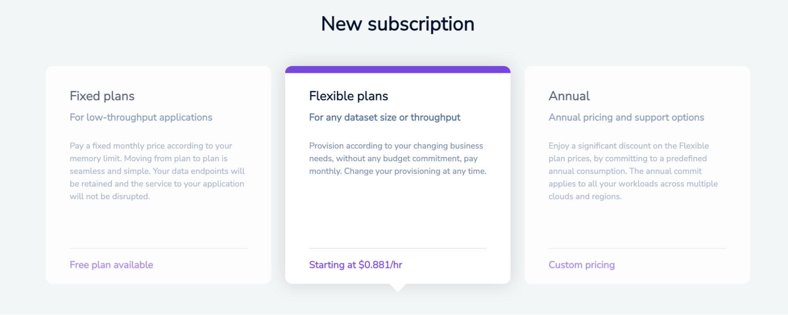
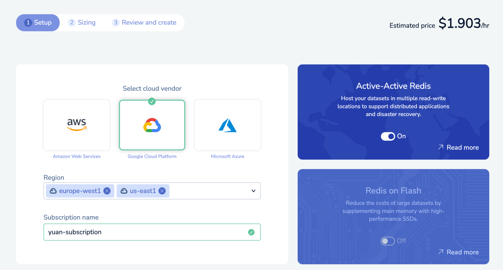
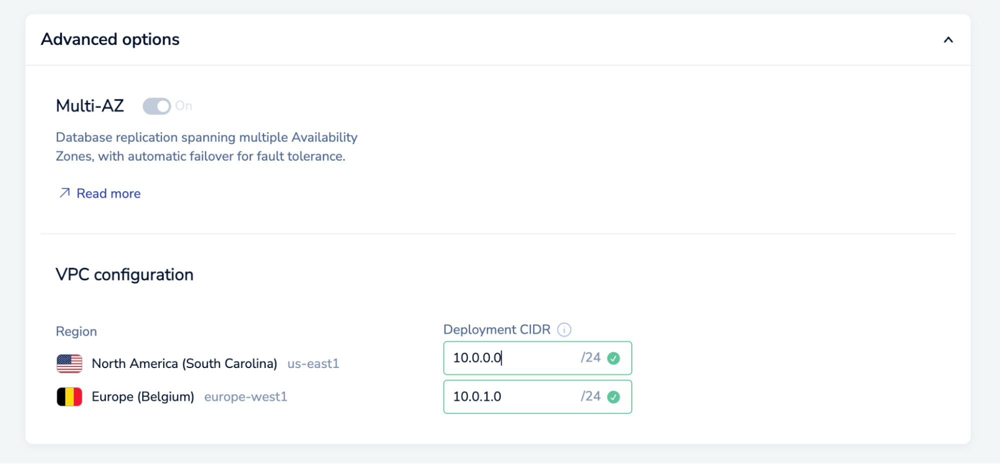
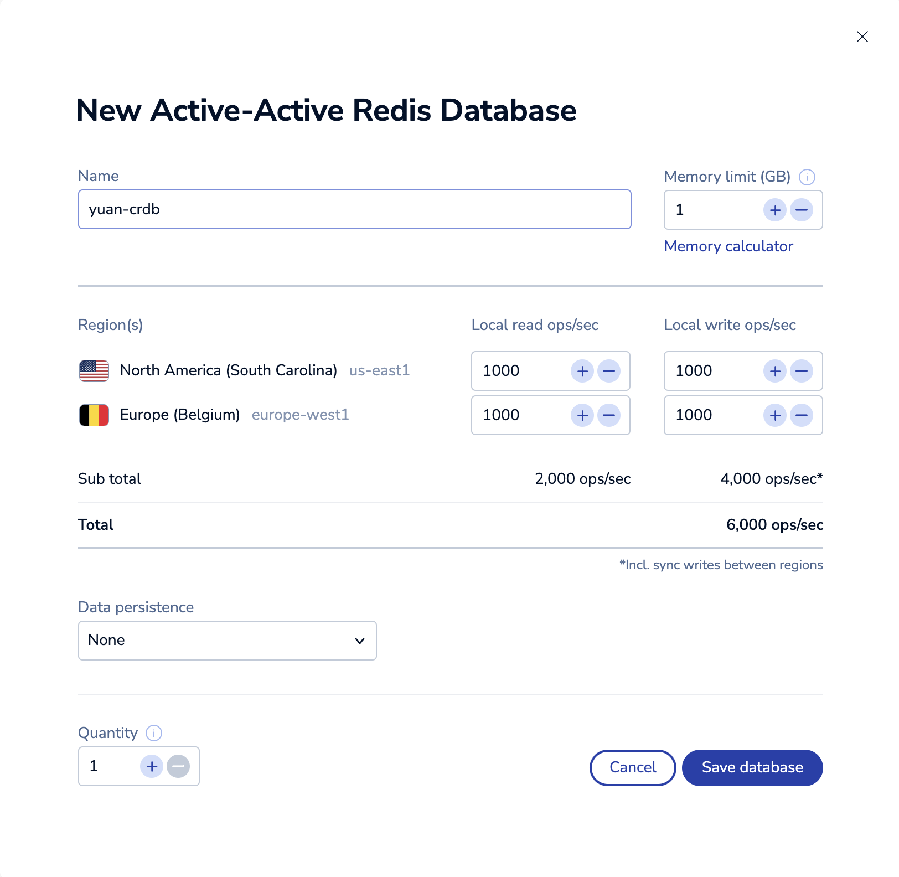
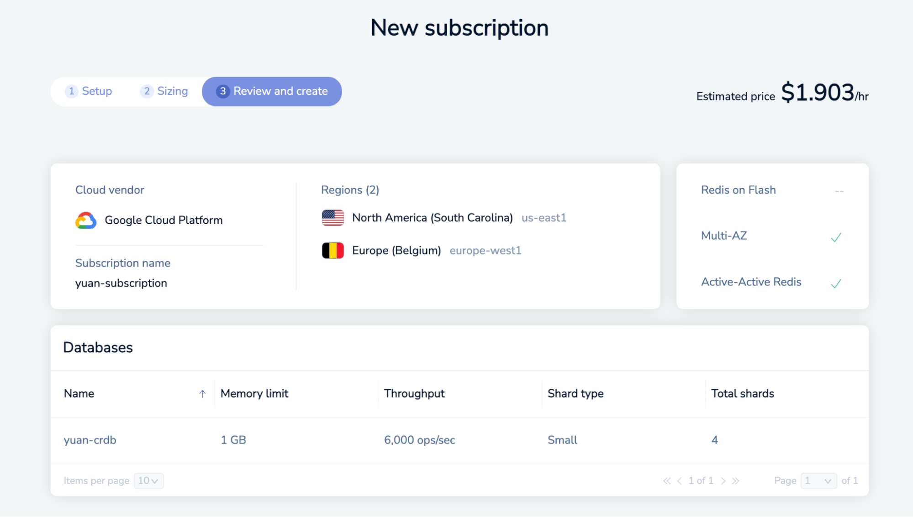

<!-- Redis Cloud Version - no A-A Redis Search available yet -->

**Real Time Search Workshop**

Lab 6 - Deploying a Five 9's Redis Environment

##### 1. Login to your Redis Cloud account and create a new Flexible plan subscription

##### 2. Enable the "Active-Active Redis" feature in this new subscription, select the regions to deploy the CRDB database and give your subscription a name

##### 3. Configure the CIDR block ranges for each VPC region making sure there is no overlap between them nor with any peered cloud VPCs

##### 

##### 4. Create a new Active-Active Redis database according to your sizing requirements

##### 

##### 5. Review the details of your new subscription and active-active database and create it

