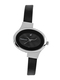

# Lab 5 - Advanced Search
Aggregation and other more complex RediSearch queries
## Contents
1.  [Business Value Statement](#value)
2.  [Modules Needed](#modules)
3.  [Vector Similarity Search](#vss)
    1.  [Data Set](#vss_dataset)
    2.  [Data Load](#vss_dataload)
    3.  [Index Creation](#vss_index)
    4.  [Search](#vss_search)
4.  [Advanced Search Queries](#adv_search)
    1.  [Data Set](#advs_dataset)
    2.  [Data Load](#advs_dataload)
    3.  [Index Creation](#advs_index)
    4.  [Search w/JSON Filtering - Example 1](#advs_ex1)
    5.  [Search w/JSON Filtering - Example 2](#advs_ex2)
5.  [Aggregation](#aggr)
    1.  [Data Set](#aggr_dataset)
    2.  [Data Load](#aggr_dataload)
    3.  [Index Creation](#aggr_index)
    4.  [Aggregation - Count](#aggr_count)
    5.  [Aggregation - Sum](#aggr_sum)

## Business Value Statement <a name="value"></a>
Redis provides the following additional advanced search capabilities to derive further value of Redis-held data:
* Vector Similarity Search - Store and search by ML-generated encodings of text and images
* Search + JSON Filtering - Combine the power of search with JSONPath filtering of search results
* Aggregation - Create processing pipelines of search results to extract analytic insights.

## Modules Needed <a name="modules"></a>
```python
from redis.commands.search.field import NumericField, TagField, TextField, VectorField 
from redis.commands.search.indexDefinition import IndexDefinition, IndexType
from redis.commands.search.query import Query
from redis.commands.search.aggregation import AggregateRequest
from redis.commands.search import reducers
from img2vec_pytorch import Img2Vec
import numpy as np
from PIL import Image
from pathlib import Path
```

## Vector Similarity Search (VSS) <a name="vss"></a>
### Syntax
[VSS](https://redis.io/docs/stack/search/reference/vectors/)

### Data Set <a name="vss_dataset"></a>
- Image 16185: Enroute Men Leather Black Formal Shoes  

- Image 4790: ADIDAS Sky Ball Brown T-shirt  

- Image 25628: Fastrack Women Charcoal Grey Dial Watch  

### Data Load <a name="vss_dataload"></a>
```python
def vectorize(self, image):
    img2vec = Img2Vec(cuda=False)       
    img = Image.open(f'{IMAGE_DIR}/{image}').convert('RGB').resize((224, 224))
    vector = img2vec.get_vec(img)
    return vector.tolist()

images = ['16185.jpg', '4790.jpg', '25628.jpg']
    for image in images:
        vec = vectorize(image)
        id = Path(image).stem
        client.json().set(f'image:{id}', '$', {'image_id': id, 'image_vector': vec})
```
### Index Creation <a name="vss_index">
#### Command
```python
schema = [ VectorField('$.image_vector', 
        'FLAT', 
        {   "TYPE": 'FLOAT32', 
            "DIM": 512, 
            "DISTANCE_METRIC": 'L2'
        },  as_name='image_vector'
        ),
        TagField('$.image_id', as_name='image_id')
]
idx_def: IndexDefinition = IndexDefinition(index_type=IndexType.JSON, prefix=['image:'])
result = client.ft('vss_idx').create_index(schema, definition=idx_def)
print(result)
```
#### Result
```bash
b'OK'
```

### Search <a name="vss_search">
#### Query Item
- Image 35460: Doodle Boys Printed Green T-shirt  

#### Command
```python
vec = _vectorize('35460.jpg')
query_vector = np.array(vec, dtype=np.float32).tobytes()
q_str = '*=>[KNN 3 @image_vector $query_vec]'
q = Query(q_str)\
    .return_fields('__image_vector_score','image_id')\
    .dialect(2)    
params_dict = {"query_vec": query_vector}
results = client.ft('vss_idx').search(q, query_params=params_dict)
print(results) 
```
#### Result
```bash
Result{3 total, docs: [Document {'id': 'image:4790', 'payload': None, '__image_vector_score': '435.736633301', 'image_id': '4790'}, Document {'id': 'image:16185', 'payload': None, '__image_vector_score': '461.923614502', 'image_id': '16185'}, Document {'id': 'image:25628', 'payload': None, '__image_vector_score': '521.258361816', 'image_id': '25628'}]}
```

## Advanced Search Queries <a name="adv_search">
### Data Set <a name="advs_dataset">
```json
{
    "city": "Boston",
    "location": "42.361145, -71.057083",
    "inventory": [
        {   
            "id": 15970,
            "gender": "Men",
            "season":["Fall", "Winter"],
            "description": "Turtle Check Men Navy Blue Shirt",
            "price": 34.95
        },
        {
            "id": 59263,
            "gender": "Women",
            "season": ["Fall", "Winter", "Spring", "Summer"],
            "description": "Titan Women Silver Watch",
            "price": 129.99
        },
        {
            "id": 46885,
            "gender": "Boys",
            "season": ["Fall"],
            "description": "Ben 10 Boys Navy Blue Slippers",
            "price": 45.99
        }
    ]
},
{
    "city": "Dallas",
    "location": "32.779167, -96.808891",
    "inventory": [
        {   
            "id": 51919,
            "gender": "Women",
            "season":["Summer"],
            "description": "Nyk Black Horado Handbag",
            "price": 52.49
        },
        {
            "id": 4602,
            "gender": "Unisex",
            "season": ["Fall", "Winter"],
            "description": "Wildcraft Red Trailblazer Backpack",
            "price": 50.99
        },
        {
            "id": 37561,
            "gender": "Girls",
            "season": ["Spring", "Summer"],
            "description": "Madagascar3 Infant Pink Snapsuit Romper",
            "price": 23.95
        }
    ]
}
```

### Data Load  <a name="advs_dataload">
```python
client.json().set('warehouse:1', '$', {
    "city": "Boston",
    "location": "-71.057083, 42.361145",
    "inventory":[
        {
            "id": 15970,
            "gender": "Men",
            "season":["Fall", "Winter"],
            "description": "Turtle Check Men Navy Blue Shirt",
            "price": 34.95
        },
        {
            "id": 59263,
            "gender": "Women",
            "season": ["Fall", "Winter", "Spring", "Summer"],
            "description": "Titan Women Silver Watch",
            "price": 129.99
        },
        {
            "id": 46885,
            "gender": "Boys",
            "season": ["Fall"],
            "description": "Ben 10 Boys Navy Blue Slippers",
            "price": 45.99
        }
    ]
})
client.json().set('warehouse:2', '$', {
    "city": "Dallas",
    "location": "-96.808891, 32.779167",
    "inventory": [
        {
            "id": 51919,
            "gender": "Women",
            "season":["Summer"],
            "description": "Nyk Black Horado Handbag",
            "price": 52.49
        },
        {
            "id": 4602,
            "gender": "Unisex",
            "season": ["Fall", "Winter"],
            "description": "Wildcraft Red Trailblazer Backpack",
            "price": 50.99
        },
        {
            "id": 37561,
            "gender": "Girls",
            "season": ["Spring", "Summer"],
            "description": "Madagascar3 Infant Pink Snapsuit Romper",
            "price": 23.95
        }
    ]
})
```

### Index Creation <a name="advs_index">
#### Command
```python
idx_def = IndexDefinition(index_type=IndexType.JSON, prefix=['warehouse:'])
schema = [
    TextField('$.city', as_name='city')
]
result = client.ft('wh_idx').create_index(schema, definition=idx_def)
print(result)
```
#### Result
```bash
b'OK'
```

### Search w/JSON Filtering - Example 1 <a name="advs_ex1">
Find all inventory ids from all the Boston warehouse that have a price > $50.
#### Command
```javascript
query = Query('@city:Boston').return_field('$.inventory[?(@.price>50)].id')
result = client.ft('wh_idx').search(query)
print(result)
```
#### Result
```bash
Result{1 total, docs: [Document {'id': 'warehouse:1', 'payload': None, '$.inventory[?(@.price>50)].id': '59263'}]}
```

### Search w/JSON Filtering - Example 2 <a name="advs_ex2">
Find all inventory items in Dallas that are for Women or Girls
#### Command
```python
query = Query('@city:Dallas')\
    .return_field('$.inventory[?(@.gender=="Women" || @.gender=="Girls")]')\
    .dialect(3)
result = client.ft('wh_idx').search(query)
print(result)
```
#### Result
```bash
Result{1 total, docs: [Document {'id': 'warehouse:2', 'payload': None, '$.inventory[?(@.gender=="Women" || @.gender=="Girls")]': '[{"id":51919,"gender":"Women","season":["Summer"],"description":"Nyk Black Horado Handbag","price":52.49},{"id":37561,"gender":"Girls","season":["Spring","Summer"],"description":"Madagascar3 Infant Pink Snapsuit Romper","price":23.95}]'}]}
```

## Aggregation <a name="aggr">
### Syntax
[FT.AGGREGATE](https://redis.io/commands/ft.aggregate/)

### Data Set <a name="aggr_dataset">
```JSON
{
    "title": "System Design Interview",
    "year": 2020,
    "price": 35.99
},
{
    "title": "The Age of AI: And Our Human Future",
    "year": 2021,
    "price": 13.99
},
{
    "title": "The Art of Doing Science and Engineering: Learning to Learn",
    "year": 2020,
    "price": 20.99
},
{
    "title": "Superintelligence: Path, Dangers, Stategies",
    "year": 2016,
    "price": 14.36
}
```
### Data Load <a name="aggr_dataload">
```python
client.json().set('book:1', '$', {"title": "System Design Interview","year": 2020,"price": 35.99})
client.json().set('book:2', '$', {"title": "The Age of AI: And Our Human Future","year": 2021,"price": 13.99})
client.json().set('book:3', '$', {"title": "The Art of Doing Science and Engineering: Learning to Learn","year": 2020,"price": 20.99})
client.json().set('book:4', '$', {"title": "Superintelligence: Path, Dangers, Stategies","year": 2016,"price": 14.36})
```

### Index Creation <a name="aggr_index">
#### Command
```python
idx_def = IndexDefinition(index_type=IndexType.JSON, prefix=['book:'])
schema = [
    TextField('$.title', as_name='title'),
    NumericField('$.year', as_name='year'),
    NumericField('$.price', as_name='price')
]
result = client.ft('book_idx').create_index(schema, definition=idx_def)
print(result)
```
#### Result
```bash
b'OK'
```

### Aggregation - Count <a name="aggr_count">
Find the total number of books per year
#### Command
```python
request = AggregateRequest(f'*').group_by('@year', reducers.count().alias('count'))
result = client.ft('book_idx').aggregate(request)
print(result.rows)
```
#### Result
```bash
[[b'year', b'2021', b'count', b'1'], [b'year', b'2020', b'count', b'2'], [b'year', b'2016', b'count', b'1']]
```

### Aggregation - Sum <a name="aggr_sum">
Sum of inventory dollar value by year
#### Command
```python
request = AggregateRequest(f'*').group_by('@year', reducers.sum('@price').alias('sum'))
result = client.ft('book_idx').aggregate(request)
print(result.rows)
```
#### Result
```bash
[[b'year', b'2021', b'sum', b'13.99'], [b'year', b'2020', b'sum', b'56.98'], [b'year', b'2016', b'sum', b'14.36']]
```